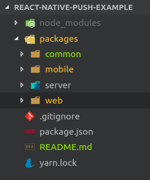
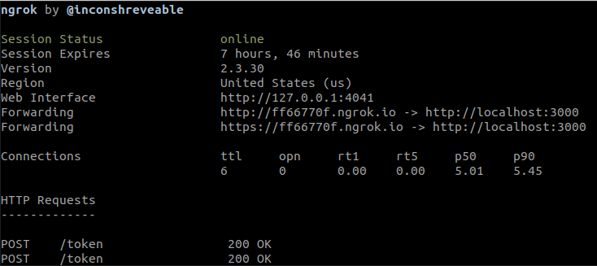
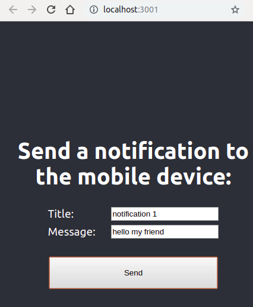
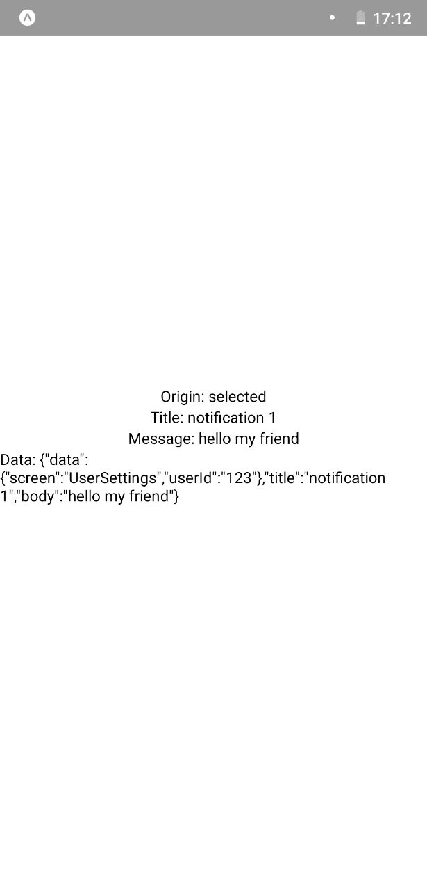

# REACT-NATIVE-PUSH-EXAMPLE

This is an example app that I used as a mentor at Udacity's React Nanodegree. In the last webinar (14: React Native Notifications)
I wanted to show an example of an app running `push notifications` because in the lessons they don't take a look to this kind of
notifications as they are "backend".

Because anyone going into React Native world I thing that a little example of push notifications could be great, I must say, that
I am using Expo and Expo server for push notifications. In real world apps you might need more configurations but as a first step
into this world I think it is enought.

## EXTRA THINGS

This code has 3 extra things that are not seeing during the nanodegree:

1. The server side itself. It is the simplest express server available to not have complex things.

2. Yarn workspaces. They work great for having a project divided in packages/modules.

3. React Hooks. I tried to build everything with hooks instead of classes, also something not studied on the nanodegree.

## HOW TO INSTALL

First you need to clone or download this repository and once you have done that you will see that the project has a `packages` folder
with 4 subfolders on it:

You need to install [`ngrok`](https://ngrok.com/) for letting the localhost:3000 server reachable from the mobile app. Also neede to have expo client installed.

1. Install dependencies

   `yarn install`

2. Launch server:

   `$ cd server`

   `$ yarn start`

3. (new terminal) Make tunnel for port of the server (usually 3000):

   `$ ngrok http 300`

   

4. On the editor go to `./packages/common/index.js` and set the variable `server_url` to the http forwarding URL given by ngrok (in this example would be http://ff66770f.ngrok.io)

5. Launch website: (new terminal)

   `$ cd web`

   `$ yarn start`

   

6. Launch mobile app: (new terminal)

   `$ cd app`

   `$ yarn start`

   

## HOW THE APP WORKS

Once you have the 3 parts working (server, app and web) you will have the website ready for sending notifications to the app in the phone (remember that you need to run over a real device, expo is fine, but emulators don't work well with push notifications). You need to run the app first so it registers its token in the server and now you can test sending notifications from the webiste.

If you see notifications duplicated restart server as the app has been restarted and each time it mounts sends a token (I will add the checking for avoiding duplicates but just in case it can happen to have 2-3 different tokens for the same device)
